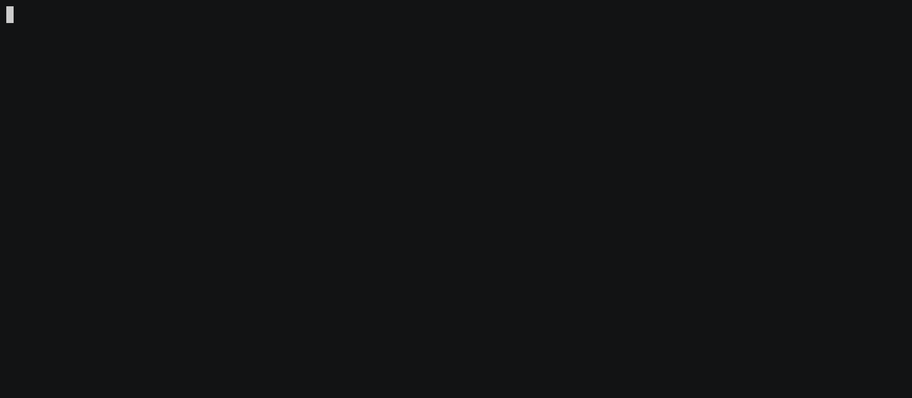
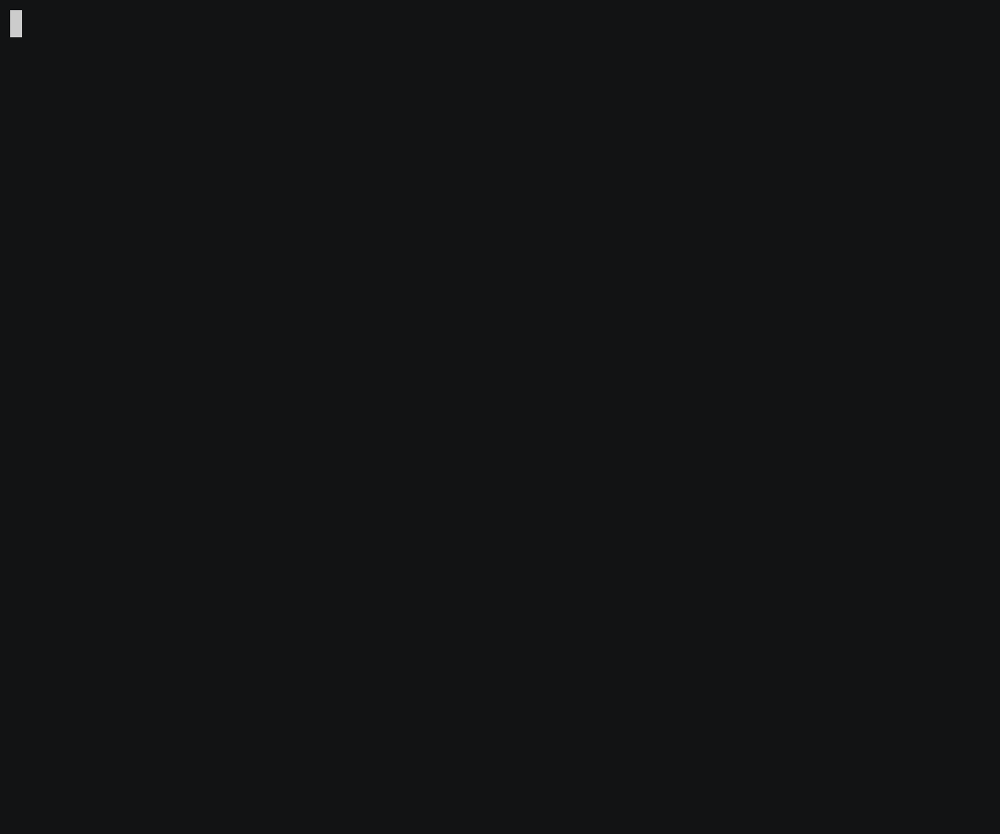
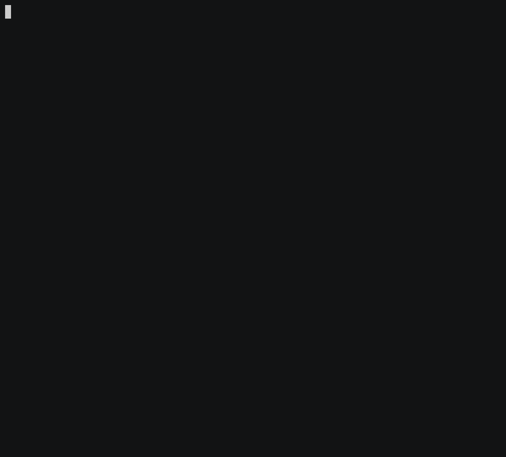

# SILG

This repository contains source code for the [Situated Interactive Language Grounding (SILG) benchmark](https://arxiv.org/abs/2110.10661).
If you find this work helpful, please consider citing this work:

```
@inproceedings{ zhong2021silg,
  title={ {SILG}: The Multi-environment Symbolic InteractiveLanguage Grounding Benchmark },
  author={ Victor Zhong and Austin W. Hanjie and Karthik Narasimhan and Luke Zettlemoyer },
  booktitle={ NeurIPS },
  year={ 2021 }
}
```

Please also consider citing the individual tasks included in SILG.
They are [RTFM](https://arxiv.org/abs/1910.08210), [Messenger](https://arxiv.org/abs/2101.07393), [NetHack Learning Environment](https://arxiv.org/abs/2006.13760), [AlfWorld](https://arxiv.org/abs/2010.03768), and [Touchdown](https://arxiv.org/abs/1811.12354).


### RTFM



### Messenger


### SILGNethack


### ALFWorld


### SILGSymTouchdown


## How to install

You have to install the individual environments in order for SILG to work.
The GitHub repository for each environment are found at

- [RTFM](https://github.com/facebookresearch/RTFM)
- [Messenger](https://github.com/ahjwang/messenger-emma/) 
- [NetHack](https://github.com/heiner/nle)
- [Alfworld](https://github.com/alfworld/alfworld)
- Sym and VisTouchdown are included in this repository

Our dockerfile also provides an example of how to install the environments in Ubuntu.
You can also try using our `install_envs.sh`, which has only been tested in Ubuntu and MacOS.

```
bash install_envs.sh
```


Once you have installed the individual environments, install SILG as follows

```
pip install -r requirements.txt
pip install -e .
```

Some environments have (potentially a large quantity of) data files. Please download these via

```
bash download_env_data.sh  # if you do not want to use VisTouchdown, feel free to comment out its very large feature file
```

As a part of this download, we will symlink a `./cache` directory from `./mycache`.
SILG environments will pull data files from this directory.
If you are on NFS, you might want to move `mycache` to local disk and then relink the `cache` directory to avoid hitting NFS.


## Docker

We provide a Docker container for this project.
You can build the Docker image via `docker build -t vzhong/silg . -f docker/Dockerfile`.
Alternatively you can pull my build from `docker pull vzhong/silg`.
This contains the environments as well as SILG, but doesn't contain the large data download.
You will still have to download the environment data and then mount the cache folder to the container.
You may need to specify `--platform linux/amd64` to Docker if you are running a M1 Mac.

Because some of the environments require that you install them first before downloading their data files, you want to download using the Docker container as well.
You can do

```
docker run --rm --user "$(id -u):$(id -g)" -v $PWD/download_env_data.sh:/opt/silg/download_env_data.sh -v $PWD/mycache:/opt/silg/cache vzhong/silg bash download_env_data.sh
```

Once you have downloaded the environment data, you can use the container by doing something like

```
docker run --rm --user "$(id -u):$(id -g)" -it -v $PWD/mycache:/opt/silg/cache vzhong/silg /bin/bash
```


## Visualizing environments

We provide a script to play SILG environments in the terminal.
You can access it via

```
silg_play --env silg:rtfm_train_s1-v0  # use -h to see options

# docker variant
docker run --rm -it -v $PWD/mycache:/opt/silg/cache vzhong/silg silg_play --env silg:rtfm_train_s1-v0
```

These recordings are shown at the start of this document and are created using [asciinema](https://github.com/asciinema/asciinema).


## How to run experiments

The entrypoint to experiments is `run_exp.py`.
We provide a slurm script to run experiments in `launch.py`.
These scripts can also run jobs locally (e.g. without slurm).
For example, to run RTFM:

```
python launch.py --local --envs rtfm
```

You can also log to WanDB with the `--wandb` option.
For more, use the `-h` flag.


# How to add a new environment

First, create a wrapper class in `silg/envs/<your env>.py`.
This wrapper will wrap the real environment and provide APIs used by the baseline models and the training script.
`silg/envs/rtfm.py` contains an example of how to do this for RTFM.
Once you have made the wrapper, don't forget to include its file in `silg/envs/__init__.py`.

The wrapper class must subclass `silg.envs.base.SILGEnv` and implement:

```
# return the list of text fields in the observation space
def get_text_fields(self):
    ...

# return max number of actions
def get_max_actions(self):
    ...

# return observation space
def get_observation_space(self):
    ...

# resets the environment
def my_reset(self):
    ...

# take a step in the environment
def my_step(self, action):
    ...
```

Additionally, you may want to implemnt rendering functions such as `render_grid`, `parse_user_action`, and `get_user_actions` so that it can be played with `silg_play`.

**Note** There is an implementation detail right now in that the Torchbeast code considers a "win" to be equivalent to the environment returning a reward `>0.8`. We hope to change this in the future (likely by adding another tensor field denoting win state) but please keep this in mind when implementing your environment. You likely want to keep the reward between -1 and +1, which high rewards >0.8 reserved for winning if you would like to use the training code as-is.


## Changelog

### Version 1.0

Initial release.
